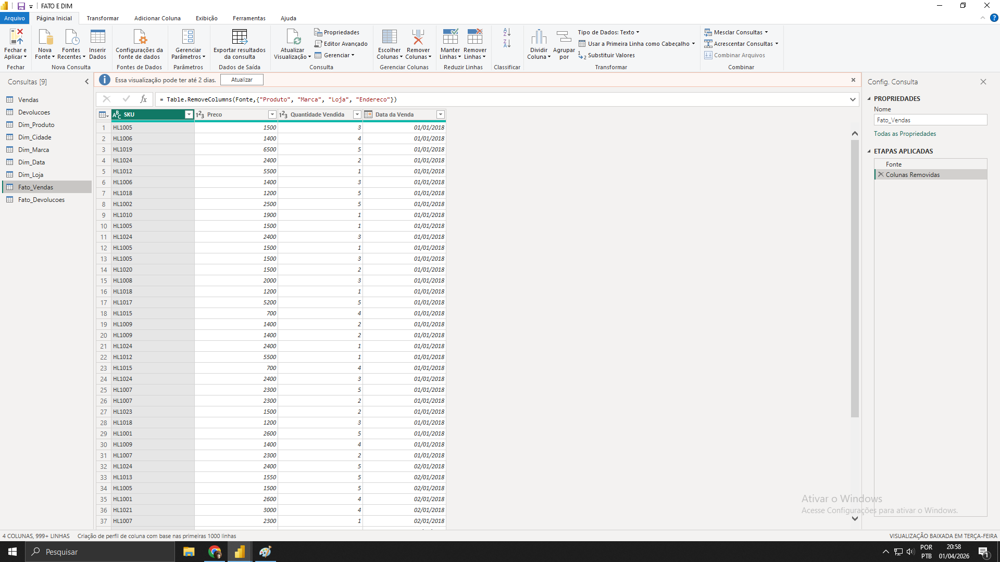
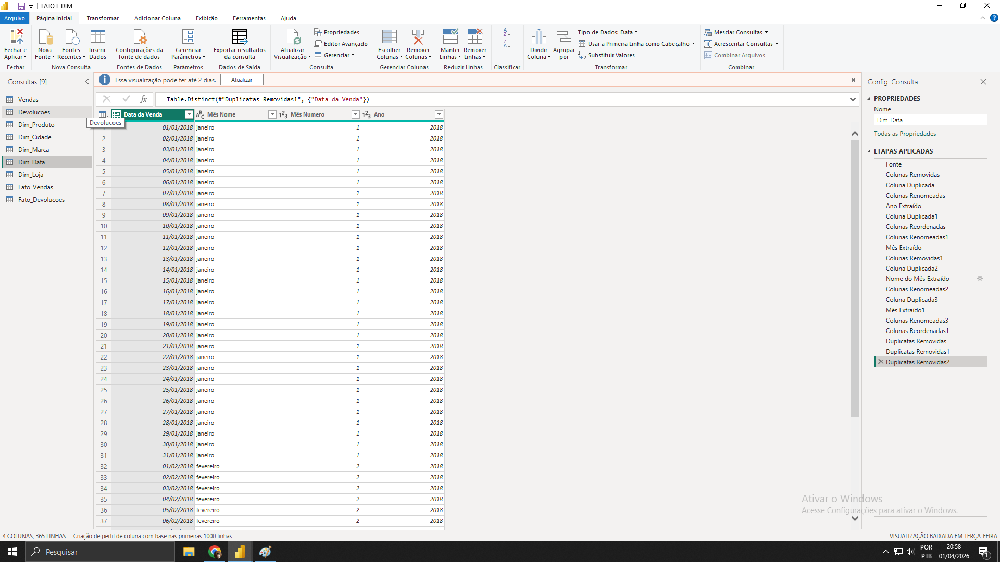
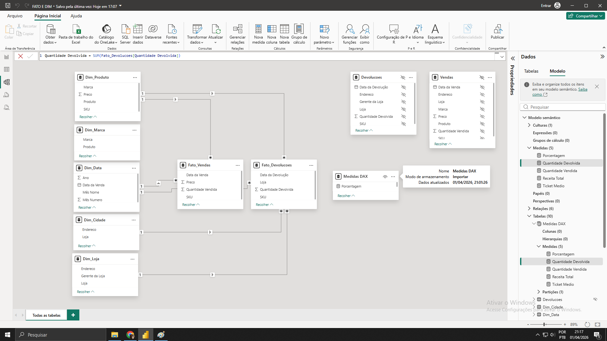
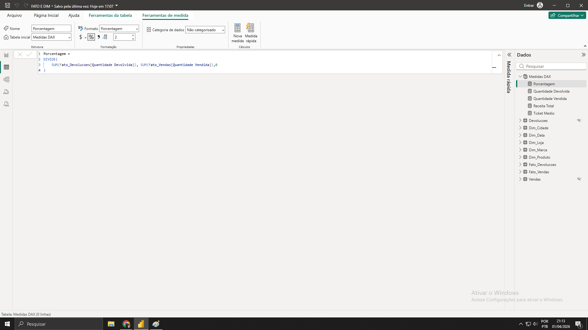
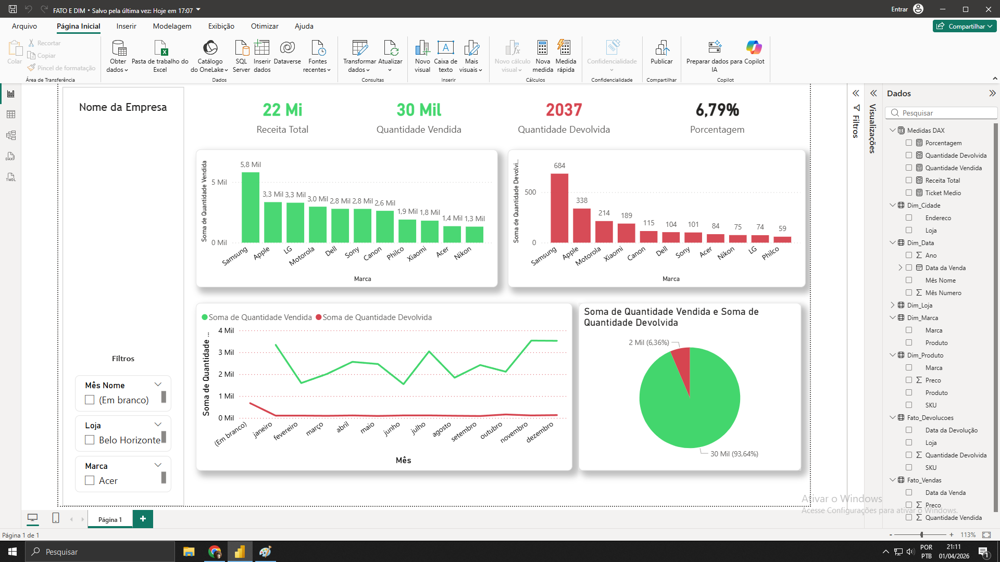

<h1>Projeto - Dashboard de Vendas Power BI</h1>

Este projeto foi desenvolvido com o objetivo de praticar modelagem dimensional,
criação de medidas DAX e desenvolvimento de dashboards no Power BI.
O projeto simula um cenário de análise de vendas com dados de vendas e devoluções.

<h2>Fonte de Dados</h2>

Os dados utilizados no projeto foram arquivos em Excel contendo informações de vendas,
produtos, lojas, datas e devoluções.

<h2>ETL - Power Query</h2>

O tratamento dos dados foi realizado no Power Query, onde foram feitas etapas como:
remoção de duplicatas, ajuste de tipos de dados, criação de colunas de data
(ano, mês, nome do mês) e organização das tabelas dimensão e fato.

<h2>Modelagem de Dados</h2>

Foi utilizado o modelo dimensional em esquema estrela (Star Schema),
com tabelas fato de vendas e devoluções e dimensões de data, produto,
marca, loja e cidade.

<h2>Medidas DAX</h2>

Foram criadas medidas DAX para cálculo dos indicadores principais do dashboard,
como Receita Total, Quantidade Vendida, Quantidade Devolvida,
Ticket Médio e Percentual de Devolução.

<h2>Dashboard</h2>

O dashboard permite analisar vendas por marca, evolução mensal,
quantidade devolvida e indicadores de desempenho.
Os filtros permitem segmentar por mês, loja e marca.

<h2>Indicadores Criados</h2>
<ul>
<li>Receita Total</li>
<li>Quantidade Vendida</li>
<li>Quantidade Devolvida</li>
<li>Ticket Médio</li>
<li>Percentual de Devolução</li>
</ul>

<h2>Ferramentas Utilizadas</h2>
<ul>
<li>Power BI</li>
<li>Power Query</li>
<li>DAX</li>
<li>Modelagem Dimensional</li>
<li>Excel</li>
</ul>

<h2>Objetivo do Projeto</h2>

O objetivo deste projeto foi praticar conceitos de Business Intelligence,
como ETL, modelagem dimensional, criação de medidas e construção de dashboards
para análise de dados.

